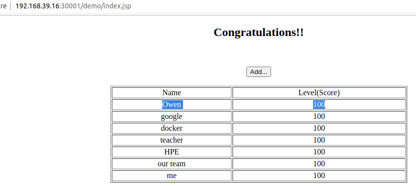

# k8s-Demo

该示例需要启动2个容器：Web App容器和MySQL容器，并且Web App容器需要访问MySQL容器。运行在Tomcat里的Web App，JSP页面通过JDBC直接访问MySQL数据库并展示数据。为了演示和简化的目的，只要程序正确连接到了数据库上，它就会自动完成对应的Table的创建与初始化数据的准备工作。所以，当我们通过浏览器访问此应用时，就会显示一个表格的页面，数据则来自数据库。

## 启动

``` shell
kubectl apply -f mysql-rc.yaml
kubectl apply -f mysql-svc.yaml
```


MySQL服务被分配了一个值为 10.101.83.101 的Cluster IP地址，这是一个虚地址，随后，Kubernetes集群中其他新创建的Pod就可以通过Service的Cluster IP+ 端口号3306来连接和访问它了。

在通常情况下，Cluster IP 是在Service创建后，由Kubernetes 系统自动分配的，其他Pod无法预先知道某个Service的Cluster IP地址，因此需要一个服务发现机制来知道这个服务。为此，最初时，Kubernetes巧妙地使用率Linux环境变量来解决这个问题。现在我们只需要知道，根据Service的唯一名字，容器可以从环境变量中获取到Service对应的Cluster IP 地址和端口，从而发起 TCP/IP 连接请求了。

``` shell
kubectl apply -f myweb-rc.yaml
kubectl apply -f myweb-svc.yaml
```


## 访问

myweb 服务对外的端口是 30001，访问 `http://<IP>:30001/demo/`


